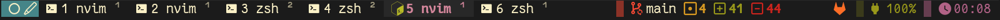
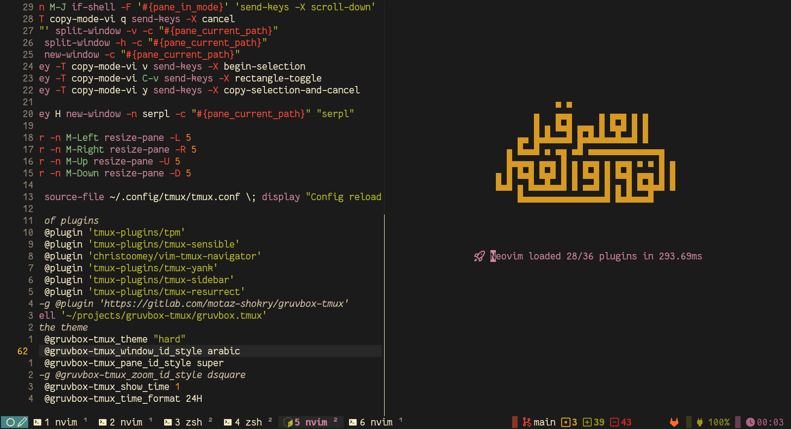
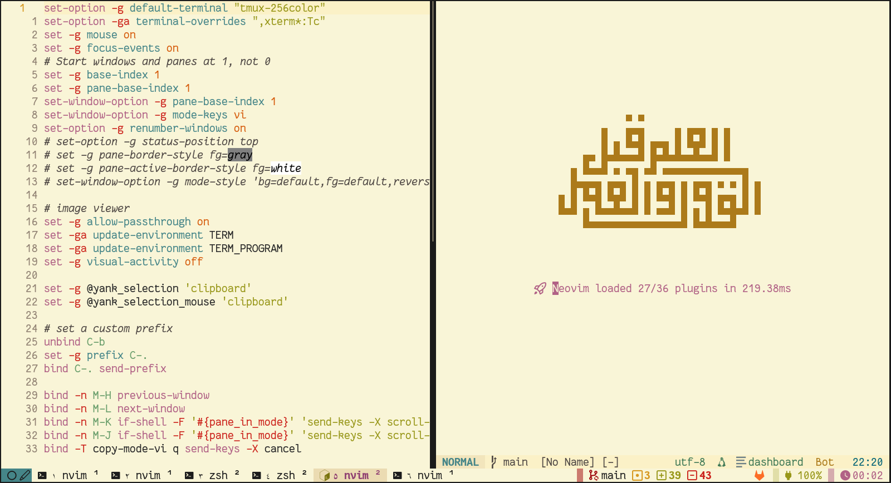

# Gruvbox Tmux



This fork starts from [motaz-shokry/gruvbox-tmux](https://gitlab.com/motaz-shokry/gruvbox-tmux) and keeps clear attribution to the original project while making the customized status layout the default.

A clean tmux theme that follows the [gruvbox](https://github.com/morhetz/gruvbox) colors, inspired by [Tokyo Night Tmux](https://github.com/janoamaral/tokyo-night-tmux).

## Requirements

This theme has the following hard requirements:

- Any font from [Nerd Fonts](https://www.nerdfonts.com/) 
- [Bash](https://www.gnu.org/software/bash/)

The following are recommended for full support of all widgets and features:

- bc (for git widgets)
- jq, gh, glab (for git forges widgets)

## Installation using TPM

In your `tmux.conf`, point TPM at this fork's Git URL:

```bash
set -g @plugin "https://github.com/jamylak/gruvbox-tmux"
```

## Configuration

Add these lines to your `.tmux.conf`:

### Theme Flavor

```bash
set -g @gruvbox-tmux_theme "medium"   # medium | soft | default is medium
set -g @gruvbox-tmux_transparent 0    # 1 | 0
set -g @gruvbox-tmux_status_interval 10
```

### Terminal icons

```bash
set -g @gruvbox-tmux_terminal_icon 
set -g @gruvbox-tmux_active_terminal_icon 
set -g @gruvbox-tmux_claude_icon 🌼
set -g @gruvbox-tmux_copilot_icon 🐙
set -g @gruvbox-tmux_codex_icon 🤖
```

Built-in app badges now cover:

- AI CLIs: Claude Code, Copilot, Codex
- editors: Helix, Neovim/Vim, Emacs
- tools: Yazi, Lazygit, btop
- shell/session: fish, tmux, ssh
- CLIs: gh, glab, gcloud, Docker/Compose, psql, Cargo/Rust, Python/Uvicorn, Nushell

### Number styles


```bash
set -g @gruvbox-tmux_window_id_style hsquare  # hsquare | fsquare | sub | super | arabic | earabic
set -g @gruvbox-tmux_pane_id_style super      # hsquare | fsquare | sub | super | arabic | earabic
set -g @gruvbox-tmux_zoom_id_style dsquare    # hsquare | fsquare | sub | super | arabic | earabic
```

### Widgets

This fork's default status line shows:

- left: prefix/copy-mode/normal icons with the session name
- right: git status, forge status, battery, and CPU/RAM metrics

You can tune the widgets with the following options.

#### Time widget

This widget is hidden by default. To enable it:

```bash
set -g @gruvbox-tmux_show_datetime 1
```

Time options

```bash
set -g @gruvbox-tmux_time_format 12H
```

##### Available Options
- `24H`: 18:30
- `12H`: 6:30 PM

#### Battery Widget

```bash
set -g @gruvbox-tmux_show_battery_widget 1     # 0 to disable
set -g @gruvbox-tmux_battery_name "BAT0"       # run `ls /sys/class/power_supply` to know
set -g @gruvbox-tmux_battery_low_threshold 25 
```

#### System metrics widget

This widget is enabled by default.

```bash
set -g @gruvbox-tmux_show_metrics 0
```

It shows CPU and RAM usage and supports macOS and Linux.


### Snapshots



